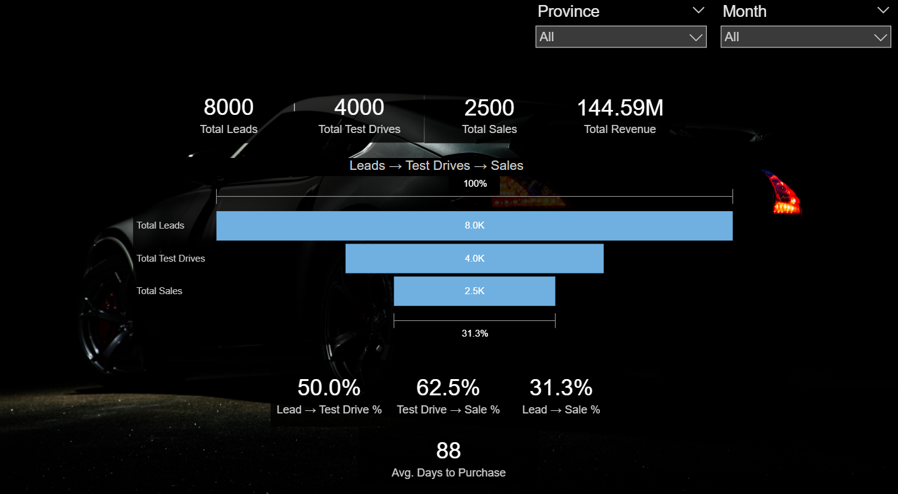
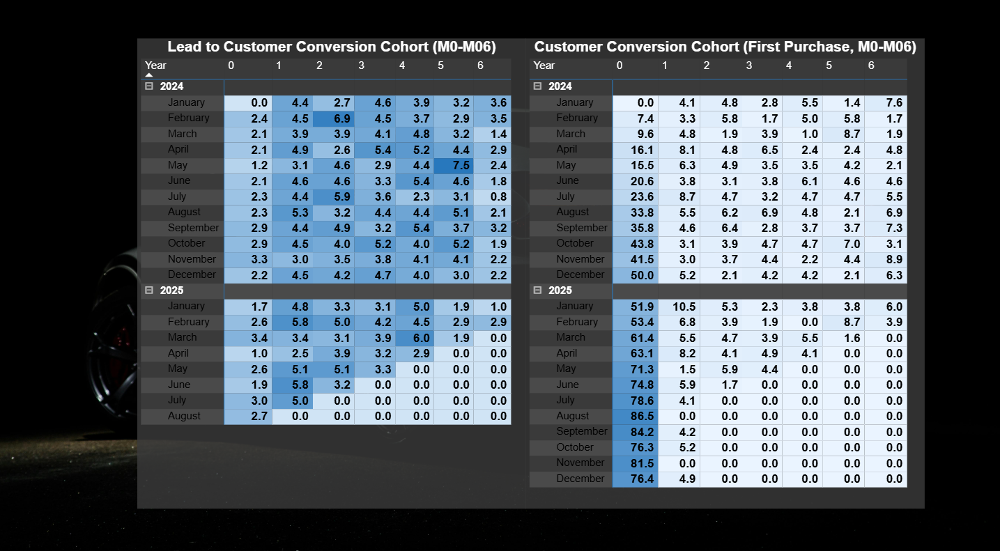
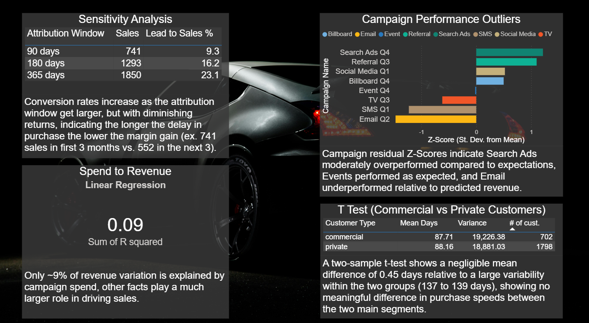
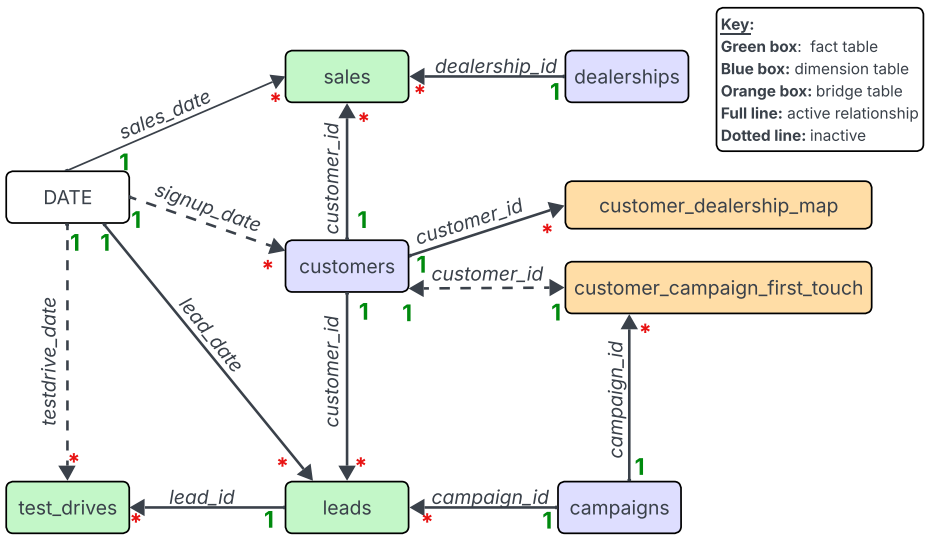

# Automobil-Verkaufsfunnel und Kampagnenanalyse
Analyse der Marketingkampagnen entlang des gesamten Verkaufsfunnels in der Automobilbranche – vom Lead bis zum Kauf. Das fünfseitige Dashboard wurde mit SQL und Power BI erstellt und zeigt Attributionssensitivität, Conversionsverhalten sowie finanzielle Kennzahlen.

### Dashboard-Einführung
Kurzes Video zur Erklärung der Dashboard-Struktur, wichtiger Kennzahlen und Erkenntnisse

<i>Das Walkthrough-Video ist auf Englisch verfügbar, mit optionalen deutsche Untertiteln</i>

[Auf Loom anschauen](https://www.loom.com/share/8e0274750cb64996bb33c546a800fc14)

---

## Problemstellung
Die Automobilindustrie ist eine der größten weltweit, und Marketingteams investieren über viele Kanäle. Es ist jedoch schwierig, genau zu bewerten, welche Kampagnen am profitabelsten sind, wenn Attributionen nicht über den gesamten Sales Funnel betrachtet werden.

<i>Dieses Portfolio beantwortet drei Kernfragen:</i>
1. Wie gut wandern Leads durch den Verkaufsfunnel, und wie ändern sich die Konversionsraten über Zeit und Regionen?
2. Welche Marketingkanäle erzielen die besten finanziellen Ergebnisse, und wie sensibel sind KPI wie ROI und CPA gegenüber Attributionsannahmen?
3. Wie unterscheiden sich Kampagnenergebnisse aus beschreibenden Kennzahlen (z. B. ROAS) von Analysen mit statistischen Methoden wie linearer Regression?
   
Ziel ist es, datenbasierte Budgetentscheidungen zu erleichtern, indem die profitabelsten Kanäle mithilfe von klaren KPIs, sauberen Datenmodellen und fundierter Analyse identifiziert werden.

---
## Daten und Tools
<b>Daten:</b>
* Synthetische CSV-Datensätze, die die komplette Customer Journey vom Lead bis zum Kauf abbilden.
* Faktentabellen umfassen Leads, Probefahrten und Verkäufe; Dimensionstabellen enthalten Kampagnen, Kunden und Autohäuser. Die Tabellengrößen reichen von 8 Zeilen (Kampagnen) bis etwa 8.000 Zeilen (Leads).

<b>Tools:</b>
* PostgreSQL kam für Datenbereinigung, Datumsaufbereitung und statistische Vorbereitung zum Einsatz.
* Power BI diente zur Datenmodellierung und Dashboard-Entwicklung, unterstützt durch Power Query (M) für Transformationen sowie DAX für KPI-Berechnungen.

---
## Dashboard-Übersicht 
Das Dashboard besteht aus fünf Seiten, die verschiedene Aspekte des Verkaufsfunnels und der Kampagnenperformance abbilden:

<b>1. Funnel-Übersicht:</b> Gesamtüberblick über zwei Jahre mit KPIs zu Leads, Probefahrten, Verkäufen, Konversionsraten und durchschnittlicher Kaufzeit. Filter nach Provinz und Monat möglich.

<b>2. Kampagnenperformance:</b> Tabelle mit Leads, Verkäufen und Profit sowie Visualisierungen (Streudiagramm Spend vs. Revenue, Balkendiagramme zu ROI, ROAS und CPA pro Kampagne).

<b>3. Autohändler-Karte:</b> Interaktive Kanada-Karte mit Blasengrößen für Verkaufsvolumen und Tooltips zu Preisen und Umsatz. Zoom- und Filterfunktion nach Kampagne und Monat.

<b>4. Kundenkohorten:</b> Zwei Heatmaps zeigen Conversion von Leads zu Kunden und Kaufgeschwindigkeit nach Erstkontakt, dargestellt nach Kohortenmonaten über sechs Monate.

<b>5. Advanced analytics:</b> Statistische Auswertungen zu Attributionssensitivität, linearer Regression (R²), Ausreißern (Z-Scores) und einem Zwei-Stichproben-T-Test für gewerbliche vs. private Kunden.

---
### Zentrele Erkentnisse

* Verkäufe erfolgen meist nicht direkt nach Lead-Erstellung. Trotz sinkendem Lead-Volumen finden viele Käufe erst in späteren Monaten statt, was erklärt, warum kurze Attributionsfenster Verkäufe unterschätzen. Die Lead-zu-Sale-Konversionsraten sind über Provinzen hinweg stabil, was auf einen konsistenten Verkaufsfunnel hinweist.

* Kampagnenleistung variiert je nach Kennzahl: Search Ads erzielen die meisten Leads und Umsätze, SMS den höchsten ROI durch sehr niedrigen CPA bei geringeren Umsätzen. Ein hoher ROI allein garantiert keine beste Gesamtperformance.

* Einige Verkäufe sind nicht eindeutig Kampagnen zuzuordnen; unzugeordnete Conversions müssen berücksichtigt werden.

* Geografisch zeigen große Autohäuser höchsten Umsatz; durchschnittliche Verkaufspreise sind standortübergreifend stabil. Kleine Händler weisen wegen niedriger Verkaufszahlen öfter Ausreißer auf. Standort wirkt stärker auf Performance als Kampagnenauswahl.

* Kohortenanalyse zeigt: Die meisten Konversionen erfolgen innerhalb von sechs Monaten, vom frühesten Kauf nach zwei bis zum spätesten nach fünf Monaten. Nach Konversion folgt meist rasch der Kauf.

* Statistische Analysen ergänzen deskriptive Daten: Z-Scores bestätigen Search Ads als klaren Überflieger und E-Mail als dauerhafte Schwäche. Der niedrige R²-Wert der Regression zeigt, dass Kampagnenausgaben nur einen kleinen Teil der Umsatzschwankungen erklären; weitere Faktoren sind maßgeblich.

---
## Dashboard und Schema Screenshots

### Seite 1: Funnel-Übersicht

### Seite 2: Kampagnenperformance

### Seite 3: Autohändler-Karte

### Seite 4: Kundenkohorten

### Seite 5: Advanced Analytics

### Snowflake Schema 

---

  <em>Automotive Sales Funnel & Campaign Anaytics Dashboard</em> 
<strong>Jonathan Todorov,
